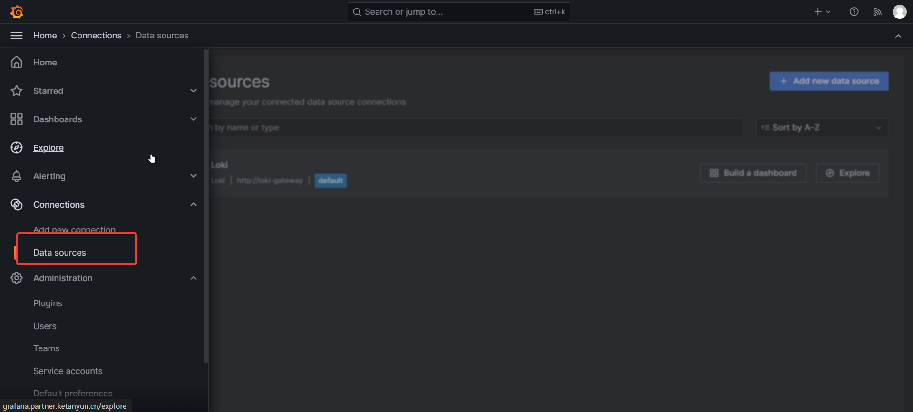
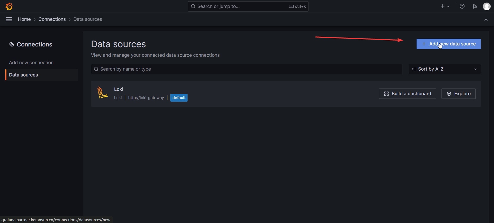
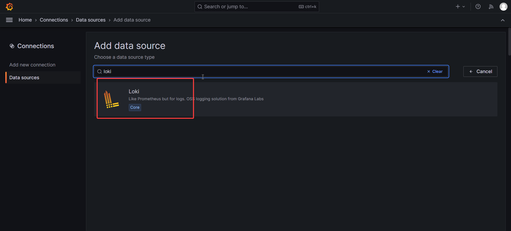
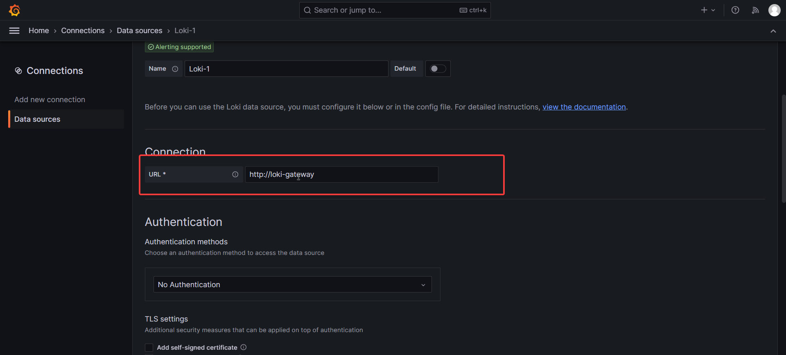
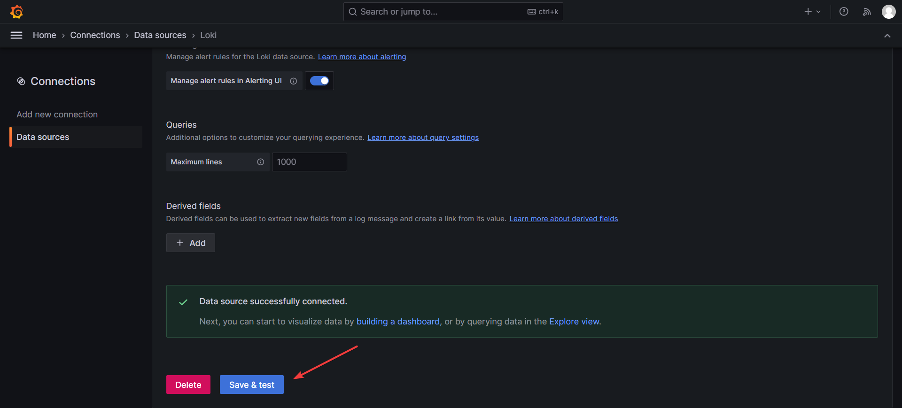
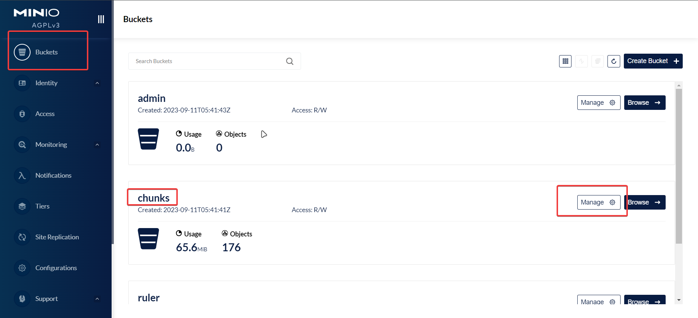
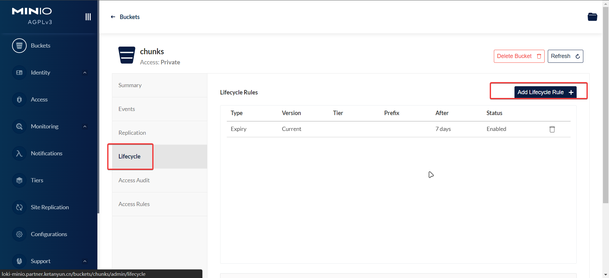
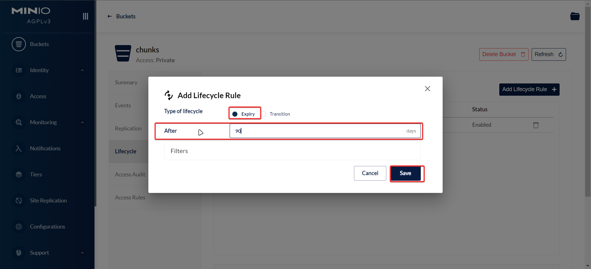

# Loki

[官方](https://grafana.com/oss/loki/)

[grafana所有charts](https://github.com/grafana/helm-charts/tree/main/charts)


[promtail文档](https://grafana.com/docs/loki/latest/clients/promtail/installation/)
[promtail charts](https://github.com/grafana/helm-charts/tree/main/charts/promtail)


## 配置charts仓库

```shell
helm repo add grafana https://grafana.github.io/helm-charts
helm repo update
```

## 部署loki

由3部分组成：

- loki: 日志处理中心（内部附带一个minio，作为实际日志数据存储后端）
- grafana: 客户端，日志查询页面
- promtail: 采集程序日志，投递到loki


### [单节点部署](https://github.com/grafana/loki/tree/main/production/helm/loki)(优先使用，资源使用少)

- 首先需要安装[local-path-provisioner](https://git.ketanyun.cn/charts/docs/-/tree/master/%E5%9F%BA%E7%A1%80%E7%8E%AF%E5%A2%83%E5%AE%89%E8%A3%85/k8s%E9%9B%86%E7%BE%A4%E7%BB%84%E4%BB%B6/local-path-provisioner)

- 安装

```shell
#--set singleBinary.nodeSelector.'kubernetes\.io/hostname'='k8s-node2' \  loki运行节点，由于本机存储，后续不能更换节点
#--set minio.rootUser='' \     minio的root用户名
#--set minio.rootPassword='' \    minio的root用户密码
#--set minio.consoleIngress.hosts[0]='loki-minio.xxx.xxx' \    minio的控制台域名
# singleBinary.persistence.storageClass 不能使用nfs，有性能要求
#--set minio.customCommands[0].command='ilm add --expiry-days 180 myminio/chunks'   设置日志保留时间，示例为保留180天

# loki 5.47.2
helm upgrade --install loki grafana/loki -n loki \
--create-namespace \
--version 5.47.2 \
--set loki.auth_enabled=false \
--set monitoring.selfMonitoring.enabled=false \
--set monitoring.selfMonitoring.grafanaAgent.installOperator=false \
--set test.enabled=false \
--set monitoring.lokiCanary.enabled=false \
--set singleBinary.replicas=1 \
--set singleBinary.persistence.size='20Gi' \
--set singleBinary.persistence.storageClass='local-path' \
--set singleBinary.nodeSelector.'kubernetes\.io/hostname'='k8s-node2' \
--set loki.commonConfig.replication_factor=1 \
--set singleBinary.resources.limits.cpu=1500m \
--set singleBinary.resources.limits.memory=1500Mi \
--set singleBinary.resources.requests.cpu=500m \
--set singleBinary.resources.requests.memory=500Mi \
--set minio.resources.limits.cpu=1000m \
--set minio.resources.limits.memory=1Gi \
--set minio.resources.requests.cpu=100m \
--set minio.resources.requests.memory=128Mi \
--set minio.enabled=true \
--set minio.mode='standalone' \
--set minio.persistence.storageClass='nfs-client' \
--set minio.persistence.size='300Gi' \
--set minio.rootUser='' \
--set minio.rootPassword='' \
--set minio.consoleIngress.enabled=true \
--set minio.consoleIngress.hosts[0]='loki-minio.xxx.xxx' \
--set minio.consoleIngress.ingressClassName=nginx \
--set minio.customCommands[0].command='ilm add --expiry-days 180 myminio/chunks' \
--set podDisruptionBudget=''
# 如果--set singleBinary.replicas=1时
#--set loki.commonConfig.replication_factor=1 \
```


### 二、[loki可扩展方式部署](https://github.com/grafana/loki/tree/main/production/helm/loki)

#### 方式一：安装loki，不启用operator，关闭自监控，使用promtail收集整个k8s的日志
```shell
# loki 5.15.0
helm upgrade --install loki grafana/loki -n loki \
--set minio.enabled=true \
--set loki.auth_enabled=false \
--set monitoring.selfMonitoring.enabled=false \
--set monitoring.selfMonitoring.grafanaAgent.installOperator=false \
--set test.enabled=false \
--set minio.persistence.storageClass='nfs-client' \
--set minio.persistence.size='200Gi' \
--set minio.rootUser='' \
--set minio.rootPassword='' \
--set minio.consoleIngress.enabled=true \
--set minio.consoleIngress.hosts[0]='loki-minio.xxx.xxx' \
--set minio.consoleIngress.ingressClassName=nginx \
```


#### 方式二：安装loki，使用operator，需要编写cr，[参考PodLogs.yaml](PodLogs.yaml)，通过cr控制收集k8s里哪些pod的日志

[PodLogs.yaml](PodLogs.yaml)

```shell
# loki 4.6.1
helm upgrade --install loki grafana/loki -n loki \
--set minio.enabled=true \
--set loki.auth_enabled=false
```


### loki可选参数

```shell
# loki副本数配置，需要根据pod数量调整，默认3，即需要3个pod，且至少有2个pod存活时才能正常工作。如果设置为1，则可以调整pod数量为1
--set read.replicas=1 \
--set write.replicas=1 \
--set backend.replicas=1 \
--set loki.commonConfig.replication_factor=1 \


# 各组件pvc配置，minio为日志存储后端，read和write的pvc只用于临时存储，但为了避免重启导致数据部分丢失，所以还是需要挂载pvc
--set minio.persistence.storageClass='nfs-client' \
--set minio.persistence.size='200Gi' \
--set write.persistence.storageClass='nfs-client' \
--set write.persistence.size='20Gi' \
--set read.persistence.storageClass='nfs-client' \
--set read.persistence.size='20Gi' \
--set backend.persistence.storageClass='nfs-client' \
--set backend.persistence.size='20Gi' \


# serviceMonitor默认开启，没有promtheus时可关闭
# 老版本中为--set serviceMonitor.enabled=false \
--set monitoring.serviceMonitor.enabled=false
--set serviceMonitor.enabled=false 

# minio认证配置
--set minio.rootUser='' \
--set minio.rootPassword='' \


# minio bucket策略配置 policy
minio:
  buckets:
    - name: chunks
      policy: none
      purge: false
    - name: ruler
      policy: none
      purge: false
    - name: admin
      policy: none
      purge: false


# 启用table manager来管理存储表的生命周期，https://grafana.com/docs/loki/latest/operations/storage/table-manager/
# 后端存储为对象存储时无效，需要通过设置存储桶的生命周期管理。
--set tableManager.enabled=true \
# 如果安装4.10.0版本，不支持以下2个参数，需要安装以后手工修改`kubectl edit cm -n loki loki`
--set tableManager.retention_deletes_enabled=true \
--set tableManager.retention_period=744h \


# 关闭loki-canary（loki系统分析组件，配置prometheus+grafana使用）
--set monitoring.lokiCanary.enabled=false \
```


## 部署promtail

```shell
# promtail 6.15.5
# 注意：默认配置docker容器日志路径为/var/lib/docker/containers，可根据实际环境情况将正确的docker路径添加配置进去即可
helm upgrade --install promtail grafana/promtail -n loki \
--version 6.15.5 \
--set configmap.enabled=true \
--set serviceMonitor.enabled=false \
--set tolerations[0].operator='Exists' 


# 默认tolerations，非必须
--set tolerations[0].key='node-role.kubernetes.io/master' \
--set tolerations[0].operator='Exists' \
--set tolerations[0].effect='NoSchedule' \
--set tolerations[1].key='node-role.kubernetes.io/control-plane' \
--set tolerations[1].operator='Exists' \
--set tolerations[1].effect='NoSchedule' \


# docker数据目录不是默认时，添加以下配置以使程序能读取到日志
--set extraVolumes[0].name='containers2' \
--set extraVolumes[0].hostPath.path='/data/docker/containers' \
--set extraVolumeMounts[0].name='containers2' \
--set extraVolumeMounts[0].mountPath='/data/docker/containers' \
--set extraVolumeMounts[0].readOnly=true \
```


## 部署grafana


```shell
kubectl create secret generic grafana-admin -n loki \
--from-literal=admin-user=admin \
--from-literal=admin-password='xxxx'

helm repo add grafana https://grafana.github.io/helm-charts
helm repo update
helm upgrade --install grafana grafana/grafana -n loki \
--version 7.3.7 \
--set ingress.enabled=true \
--set ingress.hosts[0]='grafana.site.domain' \
--set ingress.ingressClassName=nginx \
--set persistence.enabled=true \
--set persistence.storageClassName='nfs-client'  \
--set initChownData.enabled=false \
--set admin.existingSecret=grafana-admin \
--set datasources."datasources\.yaml".apiVersion="1" \
--set datasources."datasources\.yaml".datasources[0].name='Loki' \
--set datasources."datasources\.yaml".datasources[0].type='loki' \
--set datasources."datasources\.yaml".datasources[0].url='http://loki-gateway' \
--set datasources."datasources\.yaml".datasources[0].access='proxy' \
--set datasources."datasources\.yaml".datasources[0].isDefault=true 
```


## 配置数据源(配置方法说明，默认已通过helm values设置)

访问grafana页面





http://loki-gateway





## 配置数据生命周期(配置方法说明，默认已通过helm values设置)

访问minio console页面，访问方式为以下三个参数设置

```shell
--set minio.rootUser='' \
--set minio.rootPassword='' \
--set minio.consoleIngress.hosts[0]='loki-minio.xxx.xxx' \
```





设置数据保留多少天



